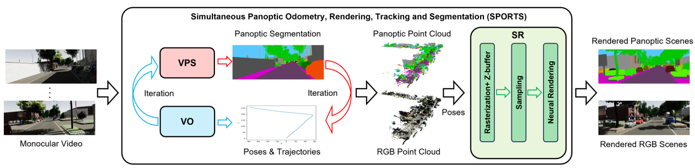

# SPORTS: Simultaneous Panoptic Odometry, Rendering, Tracking and Segmentation for Urban Scenes Understanding
We proposes a novel framework, named SPORTS, for holistic scene understanding via tightly integrating Video Panoptic Segmentation (VPS), Visual Odometry
(VO), and Scene Rendering (SR) tasks into an iterative and unified perspective.

   

## Note

Our code is mainly divided into three parts: VPS, VO, and SR. 

1. The VPS module includes both the baseline model and models integrated with various channel attention mechanisms.  
2. The VO module consists of localization, point cloud map reconstruction, and the code for matching segmentation results.
3. The SR module contains point-based rendering methods.

The initially released code in this version constitutes the core components, with the relevant configuration files and datasets to be gradually made available in subsequent phases.

## Acknowledgement

Some code snippets are borrowed from [PVO](https://github.com/zju3dv/PVO)、[Video-K-Net](https://github.com/lxtGH/Video-K-Net)、 [READ](https://github.com/JOP-Lee/READ)、[EMA](https://github.com/YOLOonMe/EMA-attention-module). Great thanks to them!
