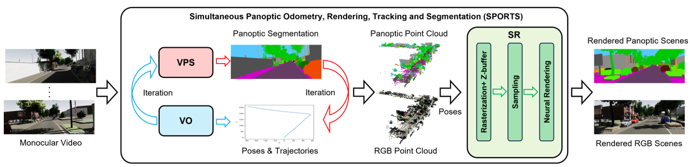

# SPORTS: Simultaneous Panoptic Odometry, Rendering, Tracking and Segmentation for Urban Scenes Understanding
We proposes a novel framework, named SPORTS, for holistic scene understanding via tightly integrating Video Panoptic Segmentation (VPS), Visual Odometry
(VO), and Scene Rendering (SR) tasks into an iterative and unified perspective.

   

## Acknowledgement

Some code snippets are borrowed from [PVO](https://github.com/zju3dv/PVO)、[Video-K-Net](https://github.com/lxtGH/Video-K-Net)、 [READ](https://github.com/JOP-Lee/READ)、[EMA](https://github.com/YOLOonMe/EMA-attention-module). Great thanks to them!
